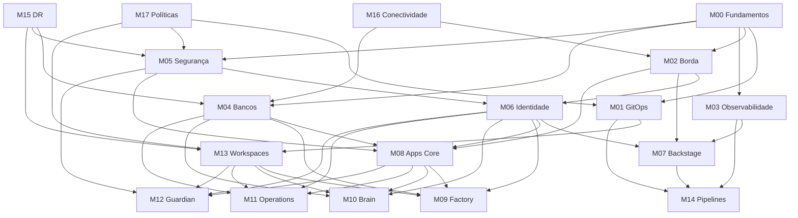

# Roadmap de Retrofit Completo - Plataforma AppGear

**Versão:** 1.0  
**Data:** 27 de novembro de 2025  
**Duração Total Estimada:** 16-20 semanas  
**Equipe Sugerida:** 1 Arquiteto Sênior + 2 DevOps + 1 Security Engineer + 1 QA

---

## 📋 Sumário Executivo

Este roadmap estrutura o retrofit completo da plataforma AppGear em **6 fases sequenciais**, garantindo:

- ✅ Validação técnica profunda por especialistas
- ✅ Correções de segurança críticas
- ✅ Cross-check de interoperabilidade entre todos os 18 módulos
- ✅ Testes end-to-end e validação de performance
- ✅ Simplificação operacional e documentação
- ✅ MVP validado com early adopters

---

## 🎯 Objetivos do Retrofit

### Objetivos Primários
1. **Segurança enterprise-grade** - Eliminar vulnerabilidades e implementar best practices
2. **Interoperabilidade garantida** - Todos os módulos M00-M17 funcionando harmonicamente
3. **Validação técnica** - Code review e aprovação por arquitetos sênior
4. **Operabilidade** - Reduzir complexidade e criar runbooks operacionais

### Objetivos Secundários
5. **Performance validada** - Testes de carga, stress e Scale-to-Zero
6. **Documentação completa** - Guias, troubleshooting e best practices
7. **MVP comercial** - 1 suíte pronta para produção

---

## 📅 Cronograma Macro

| Fase | Duração | Início | Fim | Saída Principal |
|------|---------|--------|-----|-----------------|
| **Fase 1** | 3 semanas | S1 | S3 | Relatório de auditoria técnica |
| **Fase 2** | 4 semanas | S4 | S7 | Correções críticas implementadas |
| **Fase 3** | 5 semanas | S8 | S12 | Matriz de compatibilidade validada |
| **Fase 4** | 3 semanas | S13 | S15 | Suite de testes end-to-end |
| **Fase 5** | 2 semanas | S16 | S17 | Documentação atualizada |
| **Fase 6** | 3 semanas | S18 | S20 | MVP em produção piloto |

---

## 🔍 Fase 1: Validação e Auditoria Técnica (S1-S3)

### Objetivos
- Identificar todos os problemas técnicos, de segurança e arquiteturais
- Criar baseline de qualidade
- Mapear dependências entre módulos

### Atividades Detalhadas

#### S1: Preparação e Setup
- [ ] **Contratar equipe de auditoria**
  - 2 arquitetos sênior (Kubernetes + segurança)
  - 1 security engineer (pentest)
  - Estimativa: $15k-$25k total
- [ ] **Setup de ambiente de auditoria**
  - Cluster K8s dedicado para testes
  - Ferramentas: SonarQube, Trivy, Kube-bench, Falco
- [ ] **Documentar escopo de auditoria**
  - 18 módulos técnicos
  - GitOps (90 apps em `gitops/apps/`)
  - Scripts de validação (6 scripts Python)

#### S2: Code Review e Análise Estática
- [ ] **Code review por módulo** (M00-M17)
  - Padrões de código
  - Configurações Kubernetes
  - Segurança de manifests
  - Gestão de segredos
- [ ] **Análise estática automatizada**
  - SonarQube: qualidade de código Python
  - Trivy: vulnerabilidades em imagens Docker
  - Kube-bench: compliance CIS Kubernetes
  - Checkov: IaC security
- [ ] **Criar matriz de issues**
  - Prioridade: Crítico / Alto / Médio / Baixo
  - Por módulo: M00-M17
  - Por categoria: Segurança / Performance / Arquitetura

#### S3: Pentest e Documentação
- [ ] **Pentest da cadeia de borda**
  - Traefik: bypass tentatives
  - Coraza WAF: rule evasion
  - Kong: API security
  - Istio: mTLS validation
- [ ] **Pentest de autenticação**
  - Keycloak: configurações SSO
  - Vault: gestão de segredos
  - OpenFGA: autorização granular
- [ ] **Criar relatório de auditoria**
  - Executive summary
  - Issues por prioridade
  - Plano de correção sugerido
  - Estimativa de esforço

### Deliverables Fase 1
1. **Relatório de Auditoria Técnica** (30-50 páginas)
2. **Matriz de Issues** (Excel/Notion com 100-200 items)
3. **Baseline de Métricas** (cobertura, vulnerabilidades, dívida técnica)
4. **Plano de Correção Priorizado**

### Critérios de Aceitação
- ✅ Code review completo de todos os 18 módulos
- ✅ Pentest executado com relatório CVSS
- ✅ Matriz de issues aprovada pelo idealizador
- ✅ Plano de correção com estimativas

---

## 🔧 Fase 2: Correções Críticas de Segurança (S4-S7)

### Objetivos
- Eliminar vulnerabilidades críticas e de alto risco
- Implementar best practices de segurança
- Validar cadeia de borda e gestão de segredos

### Atividades Detalhadas

#### S4: Correções de Segurança P0 (Críticas)
- [ ] **Vault: Gestão de Segredos**
  - Implementar credenciais dinâmicas (DB, Cloud)
  - Configurar políticas de acesso granulares
  - Integrar com ExternalSecrets Operator
  - Testar rotação automática
- [ ] **Remover segredos hardcoded**
  - Scan: `git secrets`, `truffleHog`
  - Substituir por referências Vault
  - Limpar histórico Git se necessário
- [ ] **Corrigir configurações Istio**
  - Validar mTLS STRICT em toda malha
  - Implementar AuthorizationPolicies
  - Configurar rate limiting

#### S5: Validação da Cadeia de Borda
- [ ] **Implementar testes automatizados**
  - Extend `edge_chain.py` com mais cenários
  - Testes de bypass (devem falhar)
  - Testes de mTLS (devem passar)
  - CI/CD integration
- [ ] **Corrigir desvios identificados**
  - IngressRoutes que bypassam WAF
  - Services expostos diretamente
  - Configurações TLS incorretas
- [ ] **Documentar cadeia de borda**
  - Diagramas atualizados
  - Troubleshooting guide
  - Runbook operacional

#### S6: Correções de Segurança P1 (Altas)
- [ ] **RBAC e Autorização**
  - Revisar ClusterRoles e Roles
  - Implementar least privilege
  - Integrar OpenFGA onde aplicável
- [ ] **Network Policies**
  - Criar policies por namespace
  - Deny-all como padrão
  - Whitelist de comunicação
- [ ] **Pod Security Standards**
  - Implementar PSS (restricted)
  - Remover privileged containers
  - Drop capabilities desnecessárias

#### S7: Validação e Testes de Segurança
- [ ] **Re-executar pentest** em áreas corrigidas
- [ ] **Executar compliance checks**
  - Kube-bench (CIS Kubernetes)
  - NSA/CISA hardening guide
- [ ] **Testes de regressão**
  - Funcionalidades continuam operando
  - Performance não degradou
- [ ] **Criar relatório de correções**

### Deliverables Fase 2
1. **Correções implementadas** (commits organizados por issue)
2. **Suite de testes de segurança** (automatizada)
3. **Relatório de pentest pós-correção**
4. **Runbooks de segurança operacional**

### Critérios de Aceitação
- ✅ Zero vulnerabilidades críticas
- ✅ Vault integrado em todos os módulos
- ✅ Cadeia de borda validada (100% compliance)
- ✅ Pentest aprovado (CVSS < 7.0 médio)

---

## 🔗 Fase 3: Cross-Check de Interoperabilidade (S8-S12)

### Objetivos
- Garantir que todos os 18 módulos funcionam harmonicamente
- Criar matriz de compatibilidade
- Validar integrações críticas
- Implementar testes de integração automatizados

### Matriz de Dependências Entre Módulos



### Atividades Detalhadas

#### S8: Validação Infraestrutura Base (M00-M05)

**M00 → M01-M05 (Fundamentos)**
- [ ] Validar `.env` centralizado e `stack-unificada-v0.3.yaml`
- [ ] Testar ApplicationSets criam workspaces corretamente
- [ ] Verificar namespaces e labels obrigatórias

**M01 (GitOps) → M13, M14**
- [ ] Argo CD sincroniza todos os módulos
- [ ] ApplicationSets (list-generator) funcionam
- [ ] Argo Workflows executam pipelines AI-First

**M02 (Borda) → M06, M07, M08**
- [ ] Traefik → Coraza → Kong → Istio (validado)
- [ ] Todos os serviços acessíveis via cadeia
- [ ] TLS termination correto

**M03 (Observabilidade) → M07, M14**
- [ ] Prometheus coleta métricas de todos os módulos
- [ ] Loki coleta logs centralizados
- [ ] Grafana dashboards para cada módulo
- [ ] OpenCost rastreia custos por workspace

**M04 (Bancos) → M08, M09, M10, M11**
- [ ] PostgreSQL acessível pelas Suítes
- [ ] Redis funcionando como cache
- [ ] Qdrant operacional para RAG
- [ ] Redpanda streaming eventos

**M05 (Segurança) → M06, M08, M12**
- [ ] Vault fornece segredos para todos os módulos
- [ ] OPA/Kyverno aplicando políticas
- [ ] Falco detectando anomalias

#### S9: Validação Serviços Core (M06-M08)

**M06 (Identidade) → M07, M08, M09-M12**
- [ ] Keycloak SSO para todos os serviços
- [ ] midPoint sincronizando identidades
- [ ] OpenFGA autorizações granulares

**M07 (Backstage) → M14**
- [ ] Portal unificado acessível
- [ ] Integração com Flowise/n8n
- [ ] FinOps dashboard funcionando
- [ ] App Store interna operacional

**M08 (Apps Core) → M09-M12**
- [ ] LiteLLM gateway único de IA (CRÍTICO)
- [ ] Flowise orquestrando workflows
- [ ] n8n executando automações
- [ ] Directus como SSoT de dados
- [ ] Appsmith UIs internas
- [ ] Metabase BI dashboards

#### S10: Validação Suítes (M09-M12)

**M09 (Factory)**
- [ ] Geração de código Backend (FastAPI/Flask)
- [ ] Geração de Frontend (React + Shadcn/UI)
- [ ] Integração com LiteLLM (não chamadas diretas OpenAI)
- [ ] CDEs (VS Code Server) com Vault
- [ ] Deploy via GitOps

**M10 (Brain)**
- [ ] RAG funcionando (Qdrant + Meilisearch + LiteLLM)
- [ ] AI Workforce (CrewAI) executando agentes
- [ ] AutoML Studio operacional
- [ ] Corporate Brain indexando documentos

**M11 (Operations)**
- [ ] ThingsBoard + PostGIS (Digital Twins)
- [ ] RPA executando automações
- [ ] Real-Time Action Center
- [ ] API Economy (Kong + Lago billing)

**M12 (Guardian)**
- [ ] Security Suite operacional
- [ ] Legal AI (Tika + Gotenberg)
- [ ] Chaos Engineering (LitmusChaos)
- [ ] IGA avançado
- [ ] SBOM geração automatizada

#### S11: Validação Workspaces e Políticas (M13-M17)

**M13 (Workspaces)**
- [ ] vClusters criam e destroem corretamente
- [ ] Isolamento entre tenants validado
- [ ] Labels `appgear.io/*` aplicadas
- [ ] Multi-tenancy lógico testado

**M14 (Pipelines AI-First)**
- [ ] Gate de IA funcionando
- [ ] SBOM gerado com hash SHA-256
- [ ] Artefatos em `/artifacts/*`
- [ ] RAPID/CCB logging

**M15 (DR/Backup)**
- [ ] Velero backups executando
- [ ] VolumeSnapshots funcionando
- [ ] Restore testado (crítico!)

**M16 (Conectividade)**
- [ ] Tailscale Mesh VPN operacional
- [ ] Acesso a sistemas legados
- [ ] Multi-cloud connectivity

**M17 (Políticas)**
- [ ] OPA/Kyverno policies ativas
- [ ] Compliance checks automatizados
- [ ] Audit logs centralizados

#### S12: Testes de Integração e Matriz

- [ ] **Criar suite de testes de integração**
  - Scripts pytest por módulo
  - Testes de dependências (M00→M01→M02...)
  - Testes de cross-module (M08→M09, M10, M11, M12)
- [ ] **Matriz de compatibilidade**
  - Tabela: módulo x módulo
  - Status: ✅ Compatível / ⚠️ Issues / ❌ Incompatível
  - Versões específicas
- [ ] **Documentar integrações**
  - Diagramas de fluxo atualizados
  - Mapa de dependências
  - Sequências de startup
- [ ] **Criar scripts de validação**
  - `validate_interoperability.py`
  - Roda matriz completa
  - Gera relatório

### Deliverables Fase 3
1. **Matriz de Compatibilidade** (18x18 módulos)
2. **Suite de testes de integração** (pytest)
3. **Diagramas de arquitetura atualizados** (Mermaid)
4. **Relatório de interoperabilidade v0.4**

### Critérios de Aceitação
- ✅ 100% dos módulos validados em pares
- ✅ Matriz de compatibilidade verde (>95%)
- ✅ Testes de integração automatizados
- ✅ Zero quebras de dependência

---

## 🧪 Fase 4: Testes End-to-End e Performance (S13-S15)

### Objetivos
- Validar cenários reais end-to-end
- Testar performance e escalabilidade
- Validar Scale-to-Zero (KEDA)
- Chaos Engineering

### Atividades Detalhadas

#### S13: Testes End-to-End por Suíte

**Cenário 1: Factory - Geração de App Completo**
- [ ] Usuário cria projeto via Backstage
- [ ] Flowise orquestra geração (Backend + Frontend)
- [ ] n8n cria repositório Git e commit
- [ ] Argo Events detecta commit
- [ ] Argo Workflows executa testes + SBOM
- [ ] Gate de IA aprova
- [ ] Argo CD faz deploy em vCluster
- [ ] App acessível via cadeia de borda
- [ ] Métricas no Grafana
- [ ] Custos no OpenCost

**Cenário 2: Brain - RAG Corporativo**
- [ ] Upload de documentos via interface
- [ ] Ingestão e processamento (Tika)
- [ ] Embedding e indexação (Qdrant)
- [ ] Query via LiteLLM
- [ ] Resposta contextualizada
- [ ] Logs de auditoria (compliance)

**Cenário 3: Operations - IoT Digital Twin**
- [ ] Registro de dispositivo IoT
- [ ] Envio de telemetria (Redpanda)
- [ ] Processamento real-time
- [ ] Atualização Digital Twin (ThingsBoard)
- [ ] Dashboard geoespacial (PostGIS)
- [ ] Alertas baseados em eventos

**Cenário 4: Guardian - Security Audit**
- [ ] Scan de vulnerabilidades
- [ ] Geração de SBOM
- [ ] Análise de conformidade
- [ ] Relatório de auditoria
- [ ] Remediação sugerida

#### S14: Testes de Performance e Carga

**Teste de Carga - Multi-Tenant**
- [ ] Simular 100 workspaces ativos
- [ ] 1000 requisições/segundo
- [ ] Validar isolamento (sem vazamento)
- [ ] Medir latência (p50, p95, p99)
- [ ] Validar limites de recursos

**Teste de Stress - KEDA Scale-to-Zero**
- [ ] Módulos ociosos devem escalar para zero
- [ ] Cold start < 30 segundos
- [ ] Scale-up sob carga
- [ ] Scale-down após cooldown
- [ ] Validar HPA e KEDA juntos

**Teste de Performance - LiteLLM**
- [ ] 100 requisições simultâneas
- [ ] Fallback entre providers
- [ ] Caching funcionando
- [ ] Billing correto por tenant

**Teste de Storage - Ceph**
- [ ] I/O performance (fio)
- [ ] Multi-tenant isolation
- [ ] Snapshot/restore speed
- [ ] Rebalancing sob carga

#### S15: Chaos Engineering e Resiliência

**Chaos Experiments (LitmusChaos)**
- [ ] **Pod deletion** - recuperação automática
- [ ] **Network latency** - circuit breakers funcionando
- [ ] **Node failure** - re-scheduling correto
- [ ] **Storage failure** - fallback para replicas
- [ ] **DNS failure** - service mesh resilience

**Testes de DR**
- [ ] **Backup completo** com Velero
- [ ] **Restore em novo cluster**
- [ ] **RPO < 1 hora**
- [ ] **RTO < 4 horas**

### Deliverables Fase 4
1. **Suite de testes E2E** (4 cenários por suíte)
2. **Relatório de performance** (benchmarks)
3. **Relatório de Chaos Engineering**
4. **Plano de DR validado**

### Critérios de Aceitação
- ✅ 4 cenários E2E executados com sucesso
- ✅ Performance: p95 < 500ms, p99 < 2s
- ✅ KEDA Scale-to-Zero validado
- ✅ 100% experimentos Chaos recuperados

---

## 📚 Fase 5: Documentação e Simplificação (S16-S17)

### Objetivos
- Criar guias práticos de instalação e operação
- Definir stack profiles (minimal/standard/enterprise)
- Documentar troubleshooting
- Atualizar documentação com achados

### Atividades Detalhadas

#### S16: Guias e Runbooks

**Guia de Início Rápido**
- [ ] **15 minutos - Hello World**
  - K3s local + minimal profile
  - Deploy de 5 componentes core
  - Primeiro workflow AI-First
- [ ] **1 hora - Stack Standard**
  - Kubernetes cluster
  - 15 componentes
  - Deploy de suíte Factory
- [ ] **1 dia - Stack Enterprise**
  - Topologia B completa
  - 4 suítes
  - Multi-tenancy

**Troubleshooting Playbooks**
- [ ] **Playbook 1: Cadeia de borda não responde**
- [ ] **Playbook 2: Vault integration quebrada**
- [ ] **Playbook 3: Scale-to-Zero não funciona**
- [ ] **Playbook 4: vCluster não cria**
- [ ] **Playbook 5: LiteLLM gateway timeout**

**Runbooks Operacionais**
- [ ] **Adicionar novo workspace**
- [ ] **Remover workspace**
- [ ] **Rotacionar segredos**
- [ ] **Atualizar módulo específico**
- [ ] **Backup e restore**
- [ ] **Disaster recovery**

#### S17: Stack Profiles e Atualização de Docs

**Definir Stack Profiles**
```yaml
# profiles.yaml
minimal:
  components: [traefik, vault, postgres, redis, litellm, flowise, n8n]
  use_case: "PoC, desenvolvimento local"
  duration: "15 min setup"
  resources: "8GB RAM, 4 CPU"

standard:
  components: [minimal + kong, istio, keycloak, backstage, qdrant]
  use_case: "Startups, MVPs"
  duration: "1 hora setup"
  resources: "32GB RAM, 16 CPU"

enterprise:
  components: [standard + 4_suites + vcluster + ceph + keda + velero]
  use_case: "Produção enterprise"
  duration: "1 dia setup"
  resources: "128GB RAM, 32 CPU, multi-node"
```

**Atualizar Documentação**
- [ ] `README.md` - incluir profiles e quick start
- [ ] `docs/architecture/contract/contract-v0.md` - incorporar achados
- [ ] `docs/architecture/interoperability/interoperability-v0.md` - matriz v0.4
- [ ] Criar `docs/guides/` com 10+ guias práticos
- [ ] Criar `docs/runbooks/` com playbooks operacionais
- [ ] Atualizar `STATUS-ATUAL.md` com estado pós-retrofit

**Vídeos e Demos**
- [ ] Screencast: instalação minimal (15 min)
- [ ] Demo: geração de app via Factory
- [ ] Demo: RAG corporativo via Brain
- [ ] Workshop: operação da plataforma (2h)

### Deliverables Fase 5
1. **3 stack profiles** (YAML + docs)
2. **10 troubleshooting playbooks**
3. **6 runbooks operacionais**
4. **Documentação atualizada** (todos os docs/)
5. **4 screencasts/demos**

### Critérios de Aceitação
- ✅ Instalação minimal funciona em 15 min
- ✅ 10 playbooks testados e validados
- ✅ Documentação revisada e aprovada
- ✅ Demos gravadas e publicadas

---

## 🚀 Fase 6: MVP e Validação de Mercado (S18-S20)

### Objetivos
- Lançar MVP focado em 1 suíte
- Conseguir 3-5 early adopters
- Coletar feedback estruturado
- Iterar baseado em dados reais

### Atividades Detalhadas

#### S18: Desenvolvimento de MVP

**Escolha da Suíte para MVP**
Recomendação: **Suíte Factory** (maior apelo comercial)

**MVP Factory - Escopo**
- [ ] **Geração de CRUD APIs**
  - FastAPI ou Flask
  - PostgreSQL integration
  - JWT authentication
  - OpenAPI docs
- [ ] **Geração de Frontends**
  - React + Vite
  - Shadcn/UI components
  - TailwindCSS styling
  - Responsive design
- [ ] **Deploy Automatizado**
  - GitOps (Argo CD)
  - Kubernetes manifests
  - CI/CD pipeline
- [ ] **Portal Web**
  - Criação de projetos
  - Templates
  - Preview deployments

**Polimento do MVP**
- [ ] UX/UI review profissional
- [ ] Testes de usabilidade (5 usuários)
- [ ] Bug fixes prioritários
- [ ] Performance optimization
- [ ] Documentação de usuário final

#### S19: Early Adopters Program

**Recrutamento (3-5 empresas)**
- [ ] **Perfil ideal:**
  - Startups tech (5-20 pessoas)
  - Necessidade de MVPs rápidos
  - Capacidade Kubernetes mínima
  - Orçamento $5k-$20k
- [ ] **Outreach:**
  - LinkedIn, Y Combinator, Product Hunt
  - Webinar: "IA para geração de apps"
  - Landing page com demos
- [ ] **Seleção:**
  - Entrevistas qualificação
  - NDA assinado
  - Compromisso de feedback

**Estrutura do Programa**
- [ ] **Setup assistido** (suporte dedicado)
- [ ] **Weekly sync** (feedback sessions)
- [ ] **Slack channel** compartilhado
- [ ] **Survey estruturado** (a cada 2 semanas)
- [ ] **Preço especial** (50% discount ou gratuito)

#### S20: Coleta de Feedback e Iteração

**Métricas de Sucesso**
- [ ] **Adoção:**
  - 3-5 early adopters ativos
  - 10+ projetos gerados
  - 50+ deployments
- [ ] **Qualidade:**
  - NPS > 30
  - Bugs críticos < 5
  - Uptime > 95%
- [ ] **Valor:**
  - Redução de 50%+ tempo de desenvolvimento
  - ROI positivo para cliente

**Feedback Estruturado**
- [ ] **Survey quinzenal:**
  - O que funcionou bem?
  - O que frustrou?
  - Features mais valiosas?
  - O que está faltando?
- [ ] **Sessões de feedback:**
  - 1h call com cada early adopter
  - Screen sharing e walkthrough
  - Identificar painpoints
- [ ] **Analytics:**
  - Features mais usadas
  - Jornadas de usuário
  - Pontos de abandono

**Iteração**
- [ ] Priorizar top 5 feedbacks
- [ ] Implementar melhorias
- [ ] Re-deploy para early adopters
- [ ] Validar correções

### Deliverables Fase 6
1. **MVP Factory** (produção-ready)
2. **3-5 early adopters** (ativos)
3. **Relatório de feedback** (insights e métricas)
4. **Roadmap de produto** (baseado em dados)

### Critérios de Aceitação
- ✅ MVP em produção com 3+ clientes
- ✅ NPS > 30
- ✅ 20+ projetos gerados com sucesso
- ✅ Feedback positivo documentado

---

## 📊 Matriz de Cross-Check Entre Módulos

### Dependências Críticas

| Módulo Origem | Módulo Destino | Tipo Integração | Teste Validação | Status |
|---------------|----------------|-----------------|-----------------|--------|
| M00 Fundamentos | M01 GitOps | ApplicationSets | `test_appsets_create_workspaces()` | ⏳ |
| M00 Fundamentos | M02 Borda | Stack base | `test_edge_chain_documented()` | ⏳ |
| M02 Borda | M06 Identidade | SSO via Kong | `test_keycloak_integration()` | ⏳ |
| M02 Borda | M08 Apps Core | LiteLLM access | `test_litellm_via_edge()` | ⏳ |
| M04 Bancos | M10 Brain | Qdrant RAG | `test_qdrant_connectivity()` | ⏳ |
| M05 Segurança | M06 Identidade | Vault→Keycloak | `test_vault_keycloak()` | ⏳ |
| M06 Identidade | M09-M12 | SSO Suítes | `test_suite_authentication()` | ⏳ |
| M08 Apps Core | M09 Factory | LiteLLM gateway | `test_factory_uses_litellm()` | ⏳ |
| M08 Apps Core | M10 Brain | RAG components | `test_brain_rag_stack()` | ⏳ |
| M13 Workspaces | M09-M12 | vCluster isolation | `test_workspace_isolation()` | ⏳ |
| M14 Pipelines | M09-M12 | AI gate | `test_ai_gate_execution()` | ⏳ |
| M15 DR | M04 Bancos | Backup/restore | `test_velero_postgres_restore()` | ⏳ |
| M16 Conectividade | M04 Bancos | Legacy DB access | `test_tailscale_db_access()` | ⏳ |

### Script de Validação Automatizada

Criar `scripts/validate_cross_check.py`:

```python
"""
Cross-check de interoperabilidade entre módulos AppGear.
Valida matriz completa de dependências M00-M17.
"""
import pytest
from pathlib import Path

# Matriz de dependências
DEPENDENCIES = {
    "M00": ["M01", "M02", "M03", "M04", "M05"],
    "M01": ["M13", "M14"],
    "M02": ["M06", "M07", "M08"],
    "M04": ["M08", "M09", "M10", "M11"],
    "M05": ["M06", "M08", "M12"],
    "M06": ["M07", "M08", "M09", "M10", "M11", "M12"],
    "M08": ["M09", "M10", "M11", "M12"],
    "M13": ["M09", "M10", "M11", "M12"],
}

def test_module_dependencies():
    """Valida que todos os módulos dependentes estão acessíveis."""
    for origin, destinations in DEPENDENCIES.items():
        for dest in destinations:
            # Implementar lógica de validação
            assert validate_module_integration(origin, dest)

def validate_module_integration(origin: str, dest: str) -> bool:
    """Valida integração específica entre dois módulos."""
    # Lógica customizada por par de módulos
    pass
```

---

## 🎯 Critérios de Sucesso Geral

### Técnicos
- ✅ Zero vulnerabilidades críticas
- ✅ 100% módulos validados em cross-check
- ✅ Testes E2E passando (4 cenários por suíte)
- ✅ Performance: p95 < 500ms
- ✅ Uptime > 99% em piloto

### Documentação
- ✅ 3 stack profiles definidos
- ✅ 10 troubleshooting playbooks
- ✅ Guia de início rápido (15 min)
- ✅ Todos os docs atualizados

### Mercado
- ✅ MVP em produção
- ✅ 3-5 early adopters ativos
- ✅ NPS > 30
- ✅ Feedback positivo documentado

---

## 📋 Próximos Passos Imediatos

### Esta Semana
1. **Aprovar este roadmap** com idealizador
2. **Contratar equipe de auditoria** (2 arquitetos + 1 security)
3. **Setup ambiente de auditoria** (cluster K8s + ferramentas)
4. **Kickoff Fase 1** (S1)

### Próximas 2 Semanas
5. Executar code review (M00-M05)
6. Executar pentest inicial
7. Criar matriz de issues
8. Apresentar relatório de auditoria

---

## 💰 Estimativa de Investimento

| Item | Custo | Justificativa |
|------|-------|---------------|
| **Auditoria técnica** | $15k-$25k | 2 arquitetos + 1 security, 3 semanas |
| **Ferramentas** | $2k-$5k | SonarQube, Trivy, LitmusChaos licenses |
| **Infraestrutura** | $3k-$5k | Clusters de teste (4 meses) |
| **Early adopters** | $0-$10k | Suporte dedicado, possível descontos |
| **Contingência** | $5k | Imprevistos |
| **TOTAL** | **$25k-$50k** | |

---

## ⚠️ Riscos e Mitigações

| Risco | Probabilidade | Impacto | Mitigação |
|-------|---------------|---------|-----------|
| Code review encontra problemas fundamentais | Alta | Alto | Reservar 2 semanas extras para refactor |
| Early adopters não encontrados | Média | Alto | Iniciar outreach em paralelo à Fase 2 |
| Incompatibilidade entre módulos | Média | Médio | Fase 3 dedicada a cross-check |
| KEDA não scale corretamente | Baixa | Médio | Validação detalhada na Fase 4 |
| Orçamento insuficiente | Média | Alto | Buscar investimento ou priorizar fases |

---

**Preparado por:** Antigravity AI Assistant  
**Versão:** 1.0  
**Data:** 27 de novembro de 2025  
**Próxima Revisão:** Após Fase 1 (S3)
